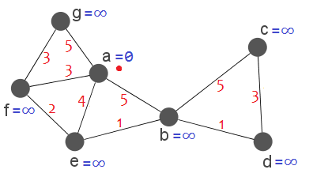
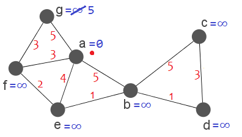
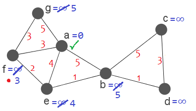
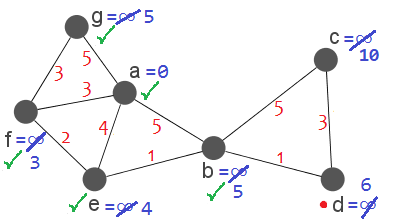

# Calculating paths,  too

Let's run the algorithm again in our graph:



 This time, however, let's keep track of the actual shortest paths. They all begin empty, except for the path of the initial node, which simply contains it:

```python
pathA = [A]
pathB = []
pathC = []
pathD = []
pathE = []
pathF = []
pathG = []
```

The new thing is that we will update those lists every time we modify the minimum distance of a node.

Let's check the neighbours of our current node. Let's begin with G. We add 0+5 = 5. As that value is less than infinity, we change the minimum distance of G with it and replace the current path of G (which is empty) with the list of the current node (`[A]`) + G. This means that `pathG = [A, G]`. 



So far, so good. Now, let's check neighbour F. We add 0 + 3 = 3, and replace the infinity value with that. We also replace the current path of F (which is empty) with the list of the current node + F: `pathF = [A, F]`.

Let's fast-forward a bit. Suppose we've just marked A as visited:



```python
pathA = [A]
pathB = [A,B]
pathC = []
pathD = []
pathE = [A,E]
pathF = [A,F]
pathG = [A,G]
```

Our next current node will be F. When we check its neighbours, we don't modify any minimum distance. Because of that, we also don't replace any current path. Remember: we only replace a current path when we modify the corresponding minimum distance.

Let's fast-forward again. We've just marked B as visited, and our current node is set to D.



```python
pathA = [A]
pathB = [A,B]
pathC = [A,B,C]
pathD = [A,B,D]
pathE = [A,E]
pathF = [A,F]
pathG = [A,G]
```

We check the only non-visited neighbour of D: C. We add 6+3=9. As that value is less than 10, we change the 10 for the 9 and replace the current path of C for the current path of D + C, so `pathC = [A,B,D,C]`.

Finally, we set C as our current node. It has no unvisited neighbours, so we're already done with it.

After we finish the algorithm, our paths will be the following:

```python
pathA = [A]
pathB = [A,B]
pathC = [A,B,D,C]
pathD = [A,B,D]
pathE = [A,E]
pathF = [A,F]
pathG = [A,G]
```

Those are the minimum paths between A and every other node!